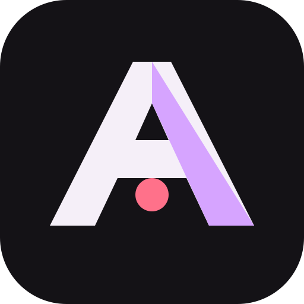
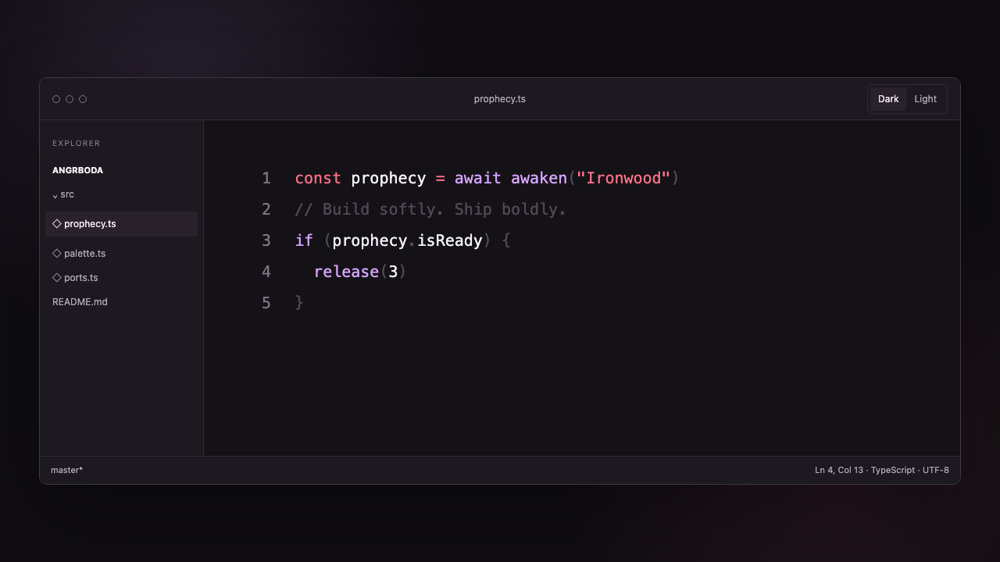
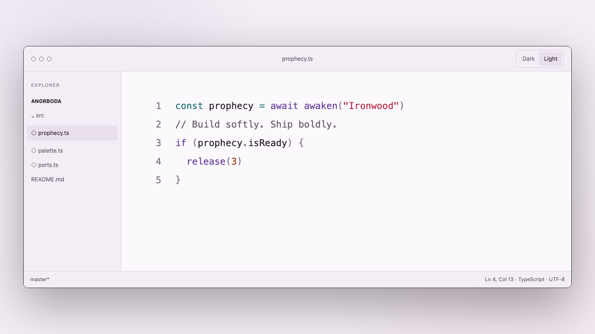

<p align="center">
  
</p>

<h1 align="center">Angrboða</h1>

<p align="center">
  <strong>Color for the bright and the buried.</strong><br>
  A mythic red and violet theme system for editors, terminals, browsers, and AI coding tools.
</p>

<p align="center">
  <a href="https://angrboda.loke.dev">Website</a> ·
  <a href="https://marketplace.visualstudio.com/items?itemName=carlssonloke.angrboda">VS Code Marketplace</a> ·
  <a href="https://github.com/loke-dev/Angrboda/releases/latest">Download every port</a>
</p>

<p align="center">
  
  
</p>

Angrboða is expressive without shouting and calm without disappearing. Its
ember-red and spectral-violet accents sit on a neutral foundation tuned for long
sessions. Dark and light modes share one typed source palette, with measured
contrast for ordinary text and consistent generated ports.

## Install

### VS Code and Cursor

Install `carlssonloke.angrboda` from the
[VS Code Marketplace](https://marketplace.visualstudio.com/items?itemName=carlssonloke.angrboda),
or download the `.vsix` from the
[latest GitHub release](https://github.com/loke-dev/Angrboda/releases/latest):

```sh
code --install-extension angrboda-1.8.1.vsix
# or
cursor --install-extension angrboda-1.8.1.vsix
```

Then choose **Angrboda Dark** or **Angrboda Light** from
**Preferences: Color Theme**.

### Everywhere else

For supported terminals, editors, and AI tools, install directly from npm:

```sh
npx angrboda list
npx angrboda zed --dry-run
npx angrboda zed
```

No global package or project dependency is added. The installer protects
existing files and creates backups only when you explicitly use `--force`.

Alternatively, download `angrboda-themes-1.8.1.zip` from the
[latest release](https://github.com/loke-dev/Angrboda/releases/latest), or use
the generated files in [`ports/`](ports):

```sh
unzip angrboda-themes-1.8.1.zip
cd angrboda
node install.mjs list
node install.mjs zed --dry-run
node install.mjs zed
```

The installer supports Alacritty, Codex, Gemini CLI, Ghostty, Helix, Kitty,
OpenCode, WezTerm, and Zed. It never edits an application's main
configuration file.

| Tool              | Format                    | Modes        |
| ----------------- | ------------------------- | ------------ |
| VS Code + Cursor  | VSIX / native themes      | dark + light |
| Zed               | native theme family       | dark + light |
| Sublime Text      | `.sublime-color-scheme`   | dark + light |
| Helix             | native TOML theme         | dark + light |
| Ghostty           | native theme              | dark + light |
| Kitty             | `.conf`                   | dark + light |
| Alacritty         | TOML import               | dark + light |
| Warp              | custom theme YAML         | dark + light |
| WezTerm           | Lua color schemes         | dark + light |
| iTerm2            | importable color presets  | dark + light |
| Windows Terminal  | JSON schemes              | dark + light |
| Codex CLI         | TextMate `.tmTheme`       | dark + light |
| Gemini CLI        | native AI harness themes  | dark + light |
| OpenCode          | native adaptive AI theme  | automatic    |
| Chrome + DevTools | unpacked Chrome theme     | dark         |
| Base16            | universal scheme palettes | dark + light |

See the [port installation guide](ports/README.md) for exact paths and setup.

## Palette

| Role       | Dark      | Light     |
| ---------- | --------- | --------- |
| Background | `#141216` | `#FCF9FD` |
| Foreground | `#F5EFF8` | `#211B24` |
| ANSI black | `#94899A` | `#453B49` |
| Ember      | `#FF718A` | `#B52643` |
| Violet     | `#D6A4FF` | `#68459B` |
| Cyan       | `#80CBC4` | `#176E6B` |
| Green      | `#78C98D` | `#25723A` |

The build validates primary text, syntax colors, and all 16 terminal ANSI colors
against WCAG AA contrast.

## Development

```sh
npm ci
npm run dev
npm run check
npm run package:vsix
```

Edit `src/colors.ts` and `src/theme.ts`. The build regenerates both VS Code
themes and every port, keeping the system in sync. See
[CONTRIBUTING.md](CONTRIBUTING.md) for the project workflow.

Tagged releases are packaged automatically. If repository secrets are present,
the same workflow also publishes to the VS Code Marketplace and Open VSX. Each
release contains both the editor VSIX and a checksummed ZIP with every generated
port, its documentation, and source themes.

## Name

Angrboða is the giantess of the Ironwood in Norse mythology—a fitting namesake
for a theme that holds light and shadow in the same system.

## License

[MIT](LICENSE) © Loke Carlsson.
